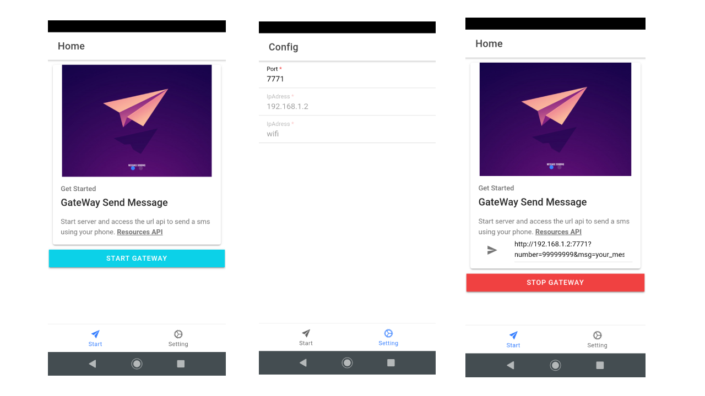

# Gateway-SMS-app
This app make the smartPhone a gateway to send sms

## Images project


### Download apk
* [Download apk](app.apk) and test in your device.

## Getting Started
```
git clone https://github.com/DekoAlencar/Gateway-SMS-app.git
```

### Installing
This project make in framework ionic with cordova.
Install the depences for project it works.
```
npm install -g ionic cordova
```

## Deployment

Project is run for API's android level 19+.

### Permission
If you run the app and your device is not allowed to send an sms, add it to AndroidMainfest.xml
```
<uses-permission android:name="android.permission.SEND_SMS" />
```
